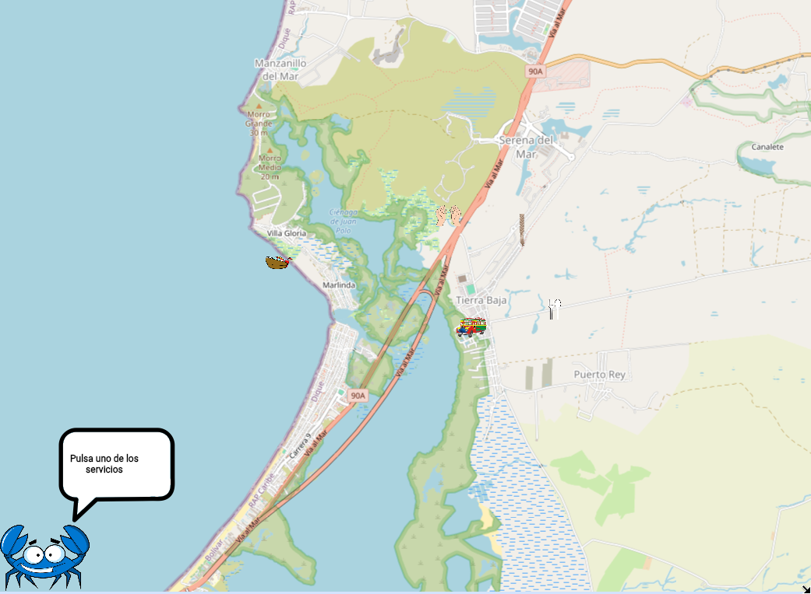
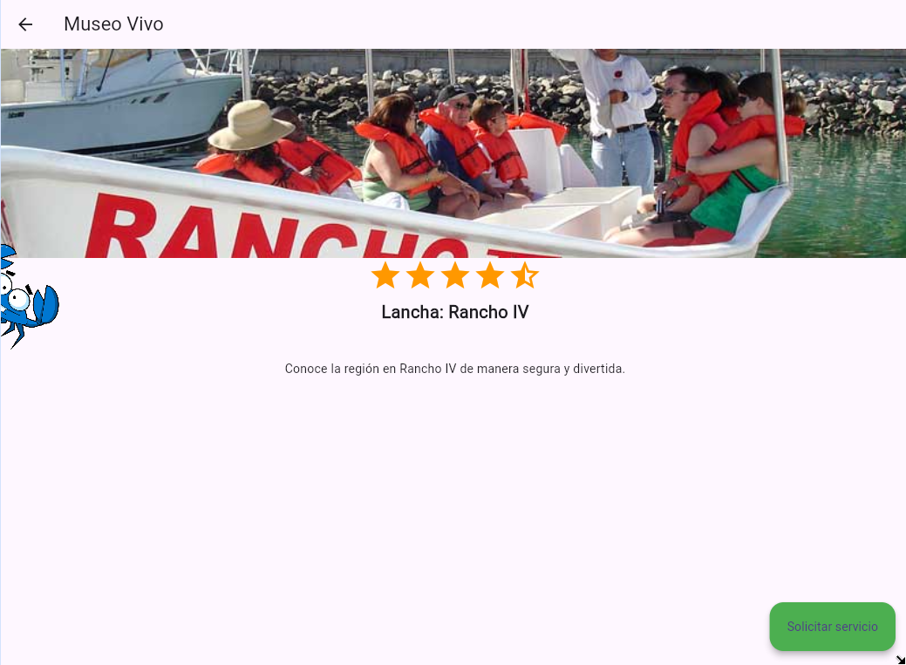

# Tourist Attractions App

## Description

A cross-platform mobile application developed using Flutter, designed 
to showcase tourist attractions and places of interest. This project 
was created as a digital project for elementary school students, 
combining educational content with practical mobile development skills.

## Screenshots

## Features

- Browse popular tourist destinations
- View images and descriptions of landmarks
- User-friendly interface designed for children
- Interactive maps and location information
- Cross-platform compatibility (Android & iOS)

## Technologies Used

- Flutter
- Dart

## Target Audience

Elementary school students and young learners interested in 
exploring tourist attractions and cultural landmarks.

## Purpose

This application was developed as an educational digital project, 
demonstrating mobile app development fundamentals while promoting 
tourism awareness among young students.

##